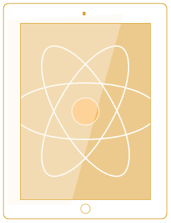

<div class="logo-img-container" style="width: 100%; text-align: center; background-color: #FCF5EA; color: #E1B251; padding: 20px 0;">
  <h1>React Devices</h1>
  
  <p>A curated collection of devices as react components.</p>
</div>

## Getting Started

```js
npm install react-devices
```

## USAGE

### Available Devices

* iPhone 4s
* iPhone 5s
* iPhone 5c
* iPhone 6
* Nexus 5
* lumia920
* Samsung S5
* htc-one
* Macbook
* iPad Mini
* Apple Watch

### Available Colors

* Silver
* Black
* Gold
* White
* Red
* Yellow
* Green
* Blue
* Silver
* Yellow Gold (Only for apple watch)
* Rose Gold (Only for apple watch)
* Space Black (Only for apple watch)
* Stainless Steel (Only for apple watch)
* Space Gray (Only for apple watch)

### Available Orientation

* landscape
* portrait

### Available Sizes (Only for apple watch)

* 38mm
* 42mm

### Some examples

```js
import React, {PropTypes, Component} from 'react';
import { IPhone, Android, IPad, MacBook, AppleWatch } from 'react-devices';

export default class App extends Component {
  constructor(props) {
    super(props);
  }

  render() {
    return (
      <div>
      <IPhone
        model="iphone6"
        color="silver"
        landscape
      />
      <Android
        model="s5"
        color="white"
      />
      <IPad
        model="ipad"
        color="silver"
        landscape
      />
      <MacBook model="macbook" />
      <AppleWatch color="rose-gold" small/>
      </div>
    );
  }
};
```


## Issues

Please [Open issue](https://github.com/pavkout/react-devices/issues), describe bug, suggest solution

## Contribution

Feel free to contribute fixes on any device or add your own to the list by creating a pull request.

To build for development

```js
npm install
npm run build
```
